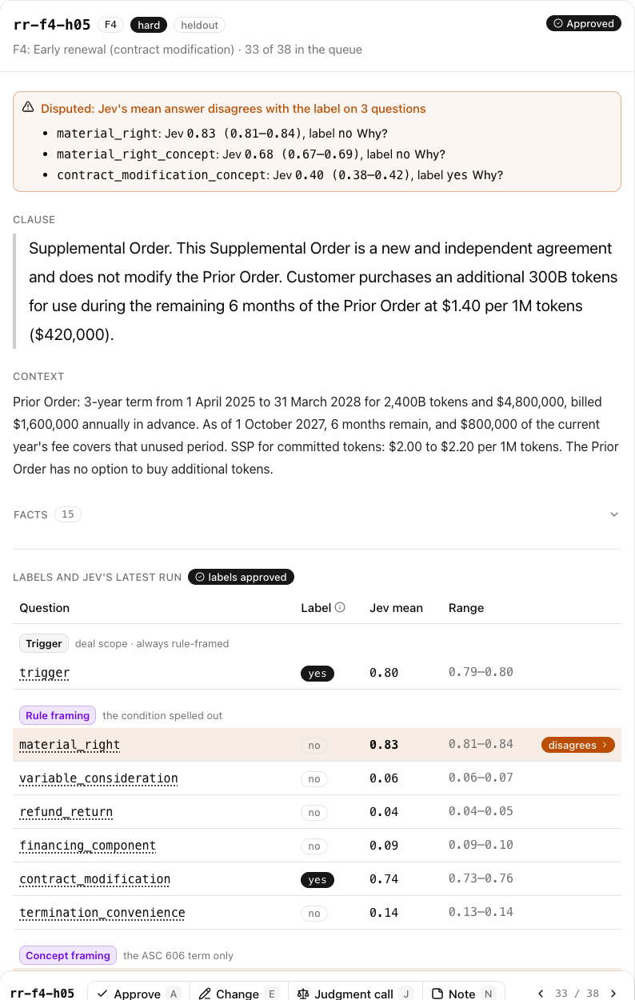
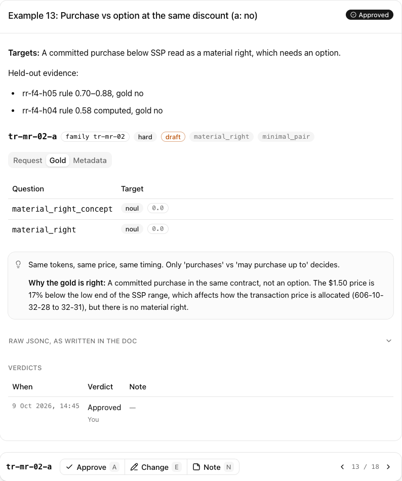

# finance-decision-evals

An evaluation of TypeSafe's calibrated decision model, Jev (`jev-1.13.0`), on a revenue-accounting
task: deciding whether a non-standard software contract clause needs a revenue accounting review,
and which ASC 606 issue it raises. I built it from my experience as a revenue accounting manager and
deal-desk lead, where this review was my job.

The results page in [`site/`](site/) tells the story in six short sections. The full write-up is
[`rev-rec/report.md`](rev-rec/report.md).

## What I found

Held-out set: 20 synthetic clauses, 3 runs each, frozen before Jev first saw them.

| Question | Result |
|---|---|
| Does this deal need a revenue accounting review? Rule written out in the question | 93% right |
| The same, with dates and price comparisons computed in code | 100% right |
| Which ASC 606 issue applies? Asked by the term's name | 89% right over the six issues, clause as written; "material right" 70–75% across setups |
| The same, with the rule written out | 94% right over the six issues, clause as written; "material right" 85–95% across setups |
| Jev's unsure answers (probability 0.5–0.7) under the full setup | right 48% of the time (29 answers) |

- **On this set, setup settles the general question.** Writing the rule into the question and
  computing the facts in code took the review call from 93% to 100% (60 of 60 calls).
- **Naming the specific issue is harder.** Jev reads ASC 606 terms of art such as "material right" in
  their everyday sense.
- **Most remaining misses are about structure.** With the full setup, 7 rule-question errors remain,
  all false alarms. Three trace to my question wording and four to how Jev reads a clause, such as a
  committed purchase read as an option.
- **Training data could close the gap.** I built [6 minimal pairs](rev-rec/training-examples.md):
  each keeps the clause the same and changes only the fact or phrase that decides the answer.

All 180 held-out calls cost $0.0076.

## How the work was done

- **Cases from facts.** The held-out clauses are generated from structured facts by a script; the
  17 dev clauses were written one by one. In both, amounts, dates and gaps are computed or checked in code
  ([`build-heldout.ts`](rev-rec/scripts/build-heldout.ts), [`check-cases.ts`](rev-rec/scripts/check-cases.ts)).
  Nothing is copied from a real contract.
- **Labels.** The clause families and label rules come from my experience running ASC 606
  deal-desk review. Claude drafted the cases and labels from my notes and rules. I reviewed every
  one, changed two drafts (rr-f2-03, rr-f4-03), which set the rule that a label records the
  accounting substance while the review call records deal scope, and approved all 17 dev and 20
  held-out labels. Two independent AI reviews labelled the held-out cases blind first
  ([`rev-rec/reviews/`](rev-rec/reviews/)). I approved 19 of the 20 on 9 October 2026, after the
  run; the freeze hash shows no label changed since. Every verdict is logged in
  [`reviews.jsonl`](rev-rec/data/reviews.jsonl).
- **A locked test set.** The held-out cases were hashed before Jev saw them
  ([`heldout-freeze.json`](rev-rec/data/heldout-freeze.json)); the runner refuses to run if they
  change. Check it with `grep '"split":"heldout"' rev-rec/data/cases.jsonl | shasum -a 256`.
- **Two axes.** Each case is asked two ways (the ASC 606 term by name, and the rule written out) and
  given the facts three ways (prose, named fields, and fields plus computed comparisons). That
  separates reading errors from knowledge errors ([`eval-design.md`](rev-rec/eval-design.md)).
- **Every call logged.** Each request and response is in [`rev-rec/runs/`](rev-rec/runs/) with the
  model version, tokens and cost. Follow-up checks are in [`probes/`](probes/).

## How I review labels

Every label passes through a small review console I built for this project. It runs locally,
reads the cases, runs and training records straight from these files, and its only write is one
line per verdict appended to [`reviews.jsonl`](rev-rec/data/reviews.jsonl). The console's code
isn't in this repo; these screenshots show what it does.

**A held-out case.** The clause and deal facts as Jev saw them, then my label for each question
beside Jev's mean answer and its range over 3 runs. Any question where Jev's answer falls on the
other side of 0.5 from the label is flagged. Here Jev reads a committed purchase as an option
(material right 0.83, label no).



**A training record.** Three tabs follow the record format: Request (what the model sees), Gold
(the correct answer to each question, 0 for no and 1 for yes) and Metadata (the facts the clause
was built from, and why the answer is right). Verdicts are listed under the record.



**The log.** Each verdict is one JSON line: the item, the verdict, who gave it, when, and a
snapshot of the item as it stood. An approval can always be checked against the record as it is
now.

## Repository

```
rev-rec/
  report.md               full write-up
  training-examples.md    the 6 training pairs, readable
  families.md             the four clause families tested
  eval-design.md          the two axes
  data/                   cases, labels, freeze record, review verdicts, training records
  questions/              question sets v0, v1, v2
  runs/                   every Jev call, plus comparison tables
  reviews/                the two blind label reviews
  scripts/                case builders, runner, scorer, freeze check, training-page renderer
probes/                   small API experiments
site/                     the results page (Next.js)
```

## Reproduce

```sh
bun install
bun rev-rec/scripts/freeze.ts check                    # held-out unchanged since the freeze
export TYPESAFE_API_KEY=…                              # your own key
bun rev-rec/scripts/run.ts --split heldout --questions v2 --state computed --reps 3
bun rev-rec/scripts/score.ts rev-rec/runs/<run>.jsonl
bun run site                                           # the results page on localhost:4200
```

The held-out answers are public. The results are for `jev-1.13.0`; a later model version may have
seen these cases.

## License

Code: [MIT](LICENSE). Data (cases, labels, reviews, runs, training examples):
[CC BY 4.0](LICENSE-DATA.md). All cases are synthetic.
